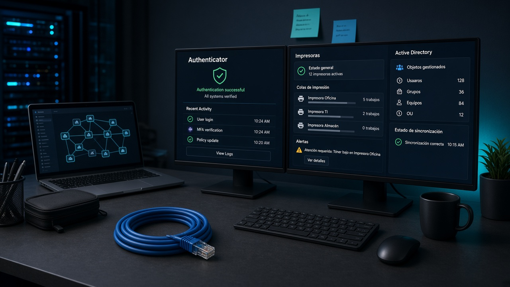
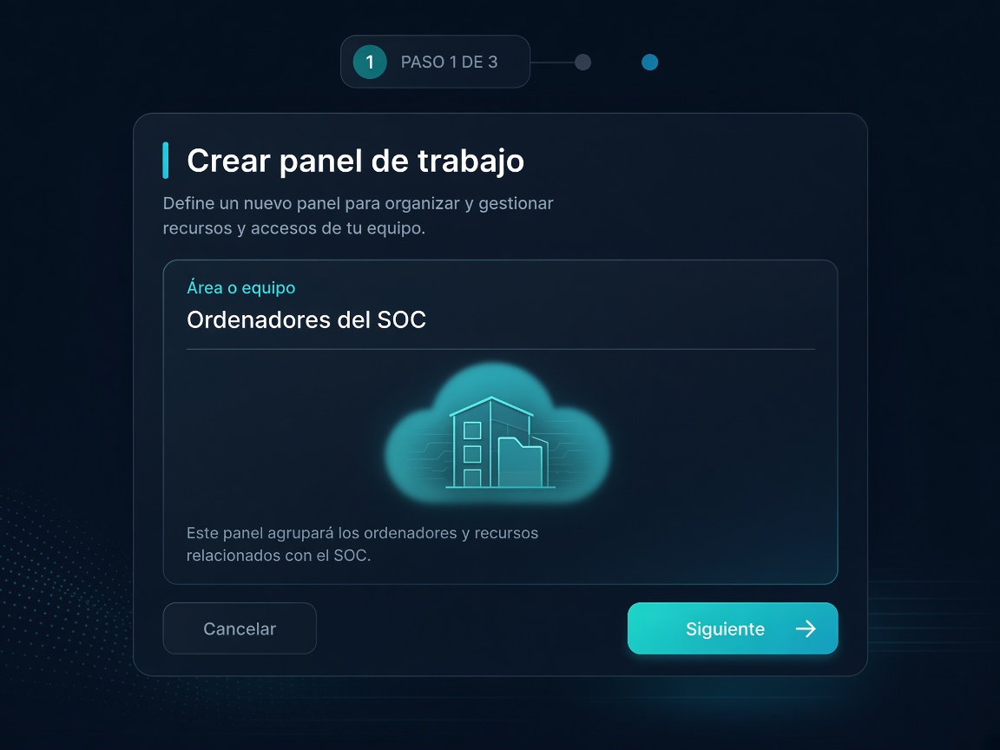
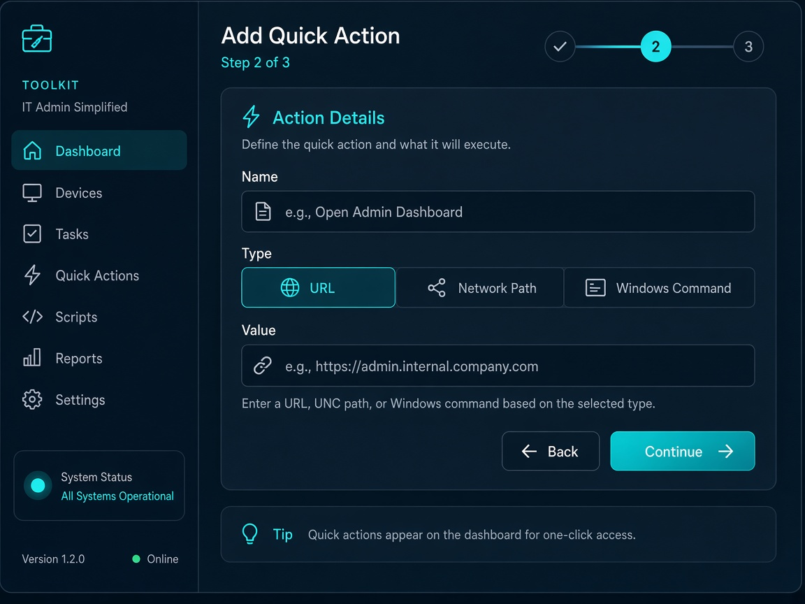
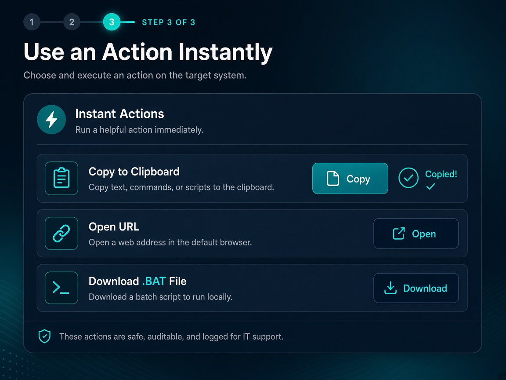

<p align="center">
  
</p>

# CT Toolkit

**Tu panel de accesos rápidos para soporte informático**

Guarda URLs, rutas de red y comandos en paneles privados. Cópialos al instante o descarga un `.BAT` listo para usar.

Creada por **CarliniTools**.

---

## ¿Para qué sirve?

<p align="center">
  
</p>

Cuando configuras o das soporte a un PC, pierdes tiempo buscando siempre lo mismo: el enlace de Authenticator, la ruta de impresoras, `ncpa.cpl`, scripts…

**CT Toolkit** concentra esos accesos en paneles de trabajo. Cada técnico tiene los suyos, sincronizados en la nube y listos en cualquier ordenador.

---

## Características pensadas para el día a día

<p align="center">
  
</p>

Menos buscar. Más resolver. Todo lo que usas en soporte, organizado y a un clic.

### Paneles de trabajo
Agrupa acciones por contexto: SOC, impresoras, Active Directory, red…

### Copiar al instante
Un clic y el valor exacto va al portapapeles: URL, UNC o comando.

### Descargar .BAT
Genera scripts Windows adaptados al tipo de acción, sin backend raro.

### Varios tipos de acción
URL, ruta de red, Windows, CMD, PowerShell o personalizado.

### Búsqueda y favoritos
Encuentra cualquier valor y marca lo que usas cada día.

### Privado por usuario
Login propio: solo ves y gestionas tus paneles en Cloudflare R2.

---

## Cómo funciona

<table>
  <tr>
    <td align="center" width="33%">
      <br />
      <strong>1. Crea un panel</strong><br />
      Por ejemplo «Herramientas de red».
    </td>
    <td align="center" width="33%">
      <br />
      <strong>2. Añade acciones</strong><br />
      Nombre, tipo y valor. Por ejemplo: «Adaptadores de red» → <code>ncpa.cpl</code>, o «Servidor de archivos» → <code>\\fs-oficina\datos</code>.
    </td>
    <td align="center" width="33%">
      <br />
      <strong>3. Úsalas al momento</strong><br />
      Copia, abre la URL o descarga el .BAT.
    </td>
  </tr>
</table>

---

## Lleva tu kit técnico a cualquier PC

Entra, abre tus paneles y sigue trabajando. Tus datos viajan contigo, no en un bloc de notas perdido.

---

## Desarrollo local

```bash
npm install
cp .dev.vars.example .dev.vars
```

Edita `.dev.vars` (`AUTH_SECRET`, `SEED_USER_PASSWORD`).

```bash
# Terminal 1 — API + R2 local
npm run dev:api

# Terminal 2 — Frontend
npm run dev
```

Abre `http://localhost:5173`.

## Despliegue (Cloudflare Worker + R2)

```bash
npx wrangler r2 bucket create ct-toolkit-data
npx wrangler secret put AUTH_SECRET
npx wrangler secret put SEED_USER_PASSWORD
npm run deploy
```

Más detalle en [`docs/AUTH_R2.md`](docs/AUTH_R2.md).

## Documentación

| Documento | Contenido |
|-----------|-----------|
| [docs/AUTH_R2.md](docs/AUTH_R2.md) | Auth + R2 + API |
| [docs/ARCHITECTURE.md](docs/ARCHITECTURE.md) | Arquitectura |
| [docs/DATA_STRUCTURE.md](docs/DATA_STRUCTURE.md) | JSON de paneles/acciones |
| [docs/BAT_GENERATION.md](docs/BAT_GENERATION.md) | Generación de BAT |
| [docs/FUTURE_IMPROVEMENTS.md](docs/FUTURE_IMPROVEMENTS.md) | Mejoras futuras |

## Seguridad

La aplicación **nunca ejecuta comandos** desde el navegador. Solo puede copiar texto, abrir URLs `http`/`https` y generar archivos `.BAT` descargables.

---

**CT Toolkit** · Creada por **CarliniTools**
